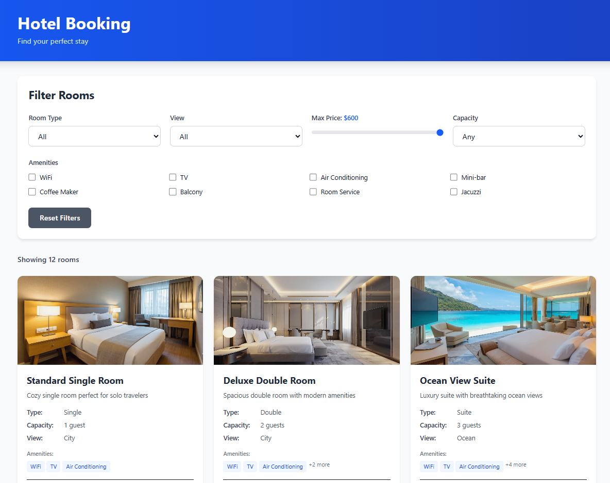

# Hotel Booking App

## Features Overview

This hotel booking application provides a complete room reservation experience with the following features:

**🏠 Room Browsing & Search**
- Browse available hotel rooms with detailed information
- View room images, descriptions, pricing, and amenities
- Filter rooms by type (Single, Double, Suite, Deluxe), view (City, Ocean, Garden), price range, capacity, and amenities
- Real-time filtering with immediate results

**🛏️ Room Details**
- Detailed room information including capacity, amenities, and descriptions
- High-quality room images
- Pricing information and availability status
- Direct booking functionality

**📝 Booking Process**
- Complete checkout flow with guest information form
- Date selection for check-in and check-out
- Booking summary with total cost calculation
- Order confirmation page with booking details

**🎨 User Experience**
- Modern, responsive design with Tailwind CSS
- Intuitive navigation between pages
- Clean card-based layout for easy room comparison
- Mobile-friendly interface

# Getting Started - Copilot
- Install the dependencies
`npm install`
 
- Run the application
`npm run dev`

- Test the app in your browser
Open `http://localhost:5173`

- Make a change and see if it is automatically reflected, for example in `index.html` change the Title with Your Name `<title>Your Name</title>`

You're all set! Use the Copilot `Agent Mode` to get started on the changes!

# Getting Started - ChatGPT or Gemini
- Copy the `repomix-output.xml` file from the app you want to change/modify
- Open https://www.chatgpt.com or https://gemini.google.com and sign in with your account
- **/!\ Important: enable the `Canvas` mode**
- Add the `repomix-output.xml` file to the chat
- Start your prompt with the following text:
`I have this app that I want to modify. Can you load the full codebase in a single file in the Canvas and make the necessary changes? Here is what I want: <ADD YOUR INSTRUCTIONS HERE>`