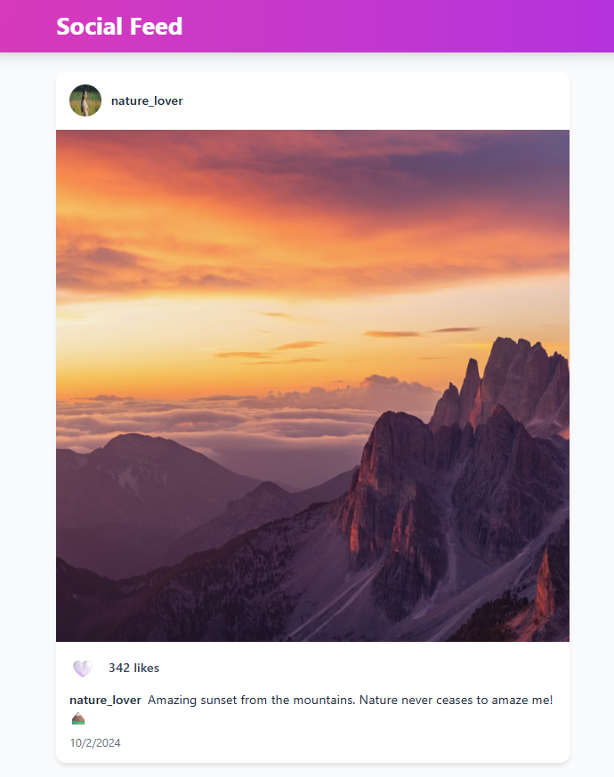

# Social Media App

## Features Overview
This social media application provides a complete social feed experience with the following features:
- **� Social Feed** - Browse posts from different users with images, captions, and user avatars
- **❤️ Interactive Likes** - Like and unlike posts with real-time like count updates
- **👤 User Profiles** - Each post displays username and profile picture
- **� Post Details** - Individual post view with full-size images and engagement details

# Getting Started - Copilot
- Navigate to the folder of the app: `cd social-media`

- Install the dependencies: `npm install`
 
- Run the application: `npm run dev`

- Test the app in your browser: Open `http://localhost:5173`

- Make a change and see if it is automatically reflected, for example in `index.html` change the Title with Your Name `<title>Your Name</title>`

You're all set! Use the Copilot `Agent Mode` to get started on the changes!

### Inspiration ideas
- Change the color scheme / theme of the app to something flashy or exotic, for example a Cyberpunk theme, Hawaii, Old Western style, Barbie inspired, Disco, ...
- Add additional features to the app, such as new menu items, pages, dashboards, ...
- Change the app into something else (e.g instead of a Social Media, make it into a Voting platform)
- .. Or ask AI to come up with ideas for you!

### Tips
- Try not to ask for too many changes at once, its better to iterate 
- If you encounter errors, ask AI to fix it for you!

# Getting Started - ChatGPT or Gemini
- Copy the `repomix-output.xml` file from the app you want to change/modify
- Open https://www.chatgpt.com or https://gemini.google.com and sign in with your account
- **/!\ Important: enable the `Canvas` mode**
- Add the `repomix-output.xml` file to the chat
- Start your prompt with the following text:
`I have this app that I want to modify. Can you load the full codebase in a single file in the Canvas and make the necessary changes? Here is what I want: <ADD YOUR INSTRUCTIONS HERE>`